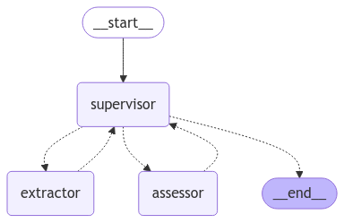

# PDF Minions
Minions are AI Agents, that cooperate to extract table with bank transactions from PDF File.
In Bank ZAK (Cler) the only way to get the transactions is to download PDF for particular month from mobile app. This pdf has many various informations, including list of transactions. Tasks for Minions:
- Agent Supervisor: Manage workflow
- Agent Extractor: Extract transactions to CSV Format - format will be specified in prompt
- Agent Assessor: Check if exported data are really CSV

Framework: LangGraph

LLM Model: Google Gemini

Supervisor Architecture



# Local DevEnv
## Langgraph Server
```PowerShell
cf-pdfminions> langgraph dev --config=langgraph.json
```

## Google Functions Framework
```PowerShell
cf-pdfminions> functions-framework --target=main --debug
```

Using Google Cloud Functions Framework from
https://cloud.google.com/functions/1stgendocs/running/function-frameworks#functions-local-ff-install-python


## Local call
PowerShell
```PowerShell
curl.exe localhost:8080 `
  -X POST `
  -H "Content-Type: application/json" `
  -d '{"gs_path": "gs://{bucket_name}/{pdf_file_object_name.pdf"}'

```
Bash
```Bash
curl.exe localhost:8080 \
  -X POST \
  -H "Content-Type: application/json" \
  -d '{"gs_path": "gs://{bucket_name}/{pdf_file_object_name.pdf"}'

```


## Trigger CF in Google Cloud
Using gcloud functions call (CLI) in Bash
```Bash
gcloud functions call cf-pdfminions \
  --project=af-finanzen \
  --region=europe-west6 \
  --data='{"gs_path": "gs://{bucket_name}/{pdf_file_object_name.pdf"}'
```
