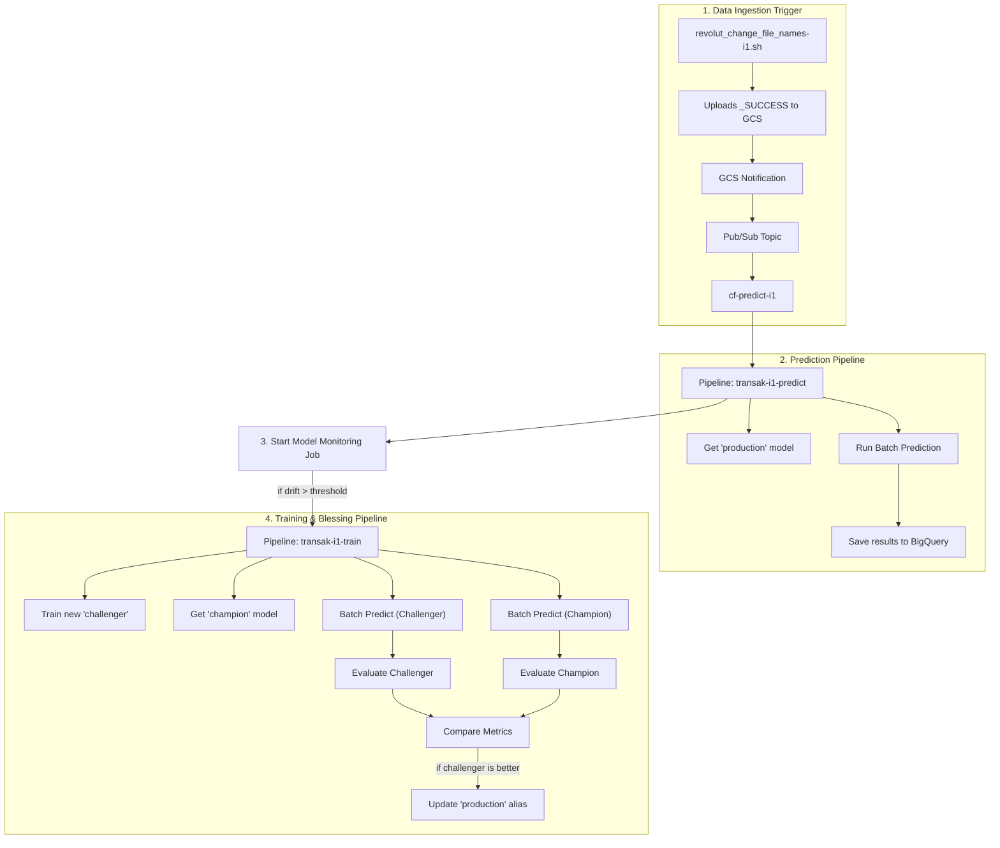

# Project Context
This is a financial services application with strict security requirements.
The model is used to classify Artur's Revolut transactions.

# MLOps Architecture: An Automated Transaction Classifier

## Overview

This document outlines a professional, end-to-end MLOps system for training, evaluating, deploying, and monitoring a transaction classification model on Google Cloud.

The architecture is built on a **two-pipeline system** to cleanly separate the concerns of model development from production prediction:
1.  Pipeline train **Training & Blessing Pipeline** responsible for creating and validating a new "champion" model.
2.  Pipeline predict **Prediction & Monitoring Pipeline** responsible for generating monthly predictions and automatically triggering retraining when data drift is detected.

A core principle of this design is the creation of a **"golden source" data table** by an initial pipeline step, ensuring that both training and prediction pipelines draw from the exact same, versioned raw data.
The entire system is orchestrated by **Vertex AI Pipelines**, with each step running as a version-controlled, **custom Docker container**.

---

## 1. Pipeline Train: The Training & Promotion Pipeline

**Goal:** To train a new "challenger" (candidate) model, evaluate it against the current "champion" (production) model, and if it proves superior, "bless" it by promoting it to become the new production champion.

**Trigger:** Can be run manually or automatically by the monitoring pipeline when data drift is detected.

### Component Workflow:

1.  **`bq_config_generator_op`**
    * **Action:** Formats the pipeline job name to extract a timestamp and constructs a BigQuery job configuration dictionary, including the fully qualified table name for the golden source data.
    * **Output:** A dictionary containing the BigQuery job configuration.

2.  **`get_golden_data_op`** (using `BigQueryQueryJobOp`)
    * **Input:** The BigQuery job configuration from `bq_config_generator_op`.
    * **Action:** This pre-built Google component executes the base SQL query to get all historical transaction data and writes it to a new, versioned "golden source" table in BigQuery.
    * **Output:** A `google.BQTable` artifact pointing to the newly created "golden source" table for this run.

3.  **`data_splits_op`**
    * **Input:** The `google.BQTable` artifact from `get_golden_data_op`.
    * **Action:** Reads from the golden source table, adds integer labels, splits the data into `train`, `val`, and `test` sets, and saves these as CSVs to Cloud Storage. The `tid` column is retained in the CSVs for traceability but is dropped before model training.
    * **Output:** `train`, `val`, and `test` `Dataset` artifacts.

4.  **`train_model_op`**
    * **Input:** `train` and `val` `Dataset` artifacts from `data_splits_op`.
    * **Action:** Trains our custom Wide & Deep Keras model on the `train` and `val` datasets, logging all metrics in real-time to **Vertex AI TensorBoard**. The `tid` column is dropped from the dataframes before being fed to the model.
    * **Output:** A trained `Model` artifact in the TensorFlow SavedModel format.

5.  **`register_model_op`**
    *   **Input:** The trained `Model` artifact from `train_model_op`.
    *   **Action:** Registers the newly trained model to the **Vertex AI Model Registry**. This version is now our `challenger` model.
    *   **Output:** A `candidate_model` artifact.

6.  **`get_production_model_op`**
    *   **Action:** Fetches the model currently aliased as `production` from the Model Registry. This is our `champion` model.
    *   **Output:** A `production_model` artifact.

7.  **`batch_predict_op` (Champion vs. Challenger)**
    *   **Action:** Triggers two parallel Vertex AI Batch Prediction Jobs on the `test` dataset: one for the `challenger` (candidate) and one for the `champion` (production).
    *   **Output:** Prediction results for both models.

8.  **`model_evaluation_op` (Champion vs. Challenger)**
    *   **Action:** Runs two parallel evaluation jobs on the prediction results from the prior step to calculate performance metrics for both the `champion` and `challenger` models.
    *   **Output:** Evaluation metrics for both models.

9.  **`bless_or_not_to_bless_op`**
    *   **Input:** Evaluation metrics from the `champion` and `challenger` models.
    *   **Action:** Compares the performance metrics of the two models.
    *   **Output:** A decision string: "bless" or "don't bless".

10. **`bless_model_op` (Conditional Step)**
    *   **Action:** This is the final quality gate, implemented as a `dsl.Condition` that runs **only if** the output from the `bless_or_not_to_bless_op` is "bless".
    * If the condition is met, this component uses the Vertex AI SDK to **update the model's aliases** in the Model Registry. It removes the `production` alias from the old model version and assigns it to our new, superior `challenger` version. The new model is now officially "blessed".

---

## 2. Pipeline Predict: The Prediction & Monitoring Pipeline

**Goal:** To generate monthly predictions using the best available model and to continuously monitor for data drift.

**Trigger:** Event-driven. The pipeline starts automatically when new Revolut data is uploaded.
1.  A local script (`bash/revolut_change_file_names-i1.sh`) uploads monthly data and a `_SUCCESS` file to GCS.
2.  A GCS notification sends a message to a Pub/Sub topic.
3.  A Cloud Function (`cf-predict-i1`) is triggered, which reads the month from the file and starts the Vertex AI prediction pipeline.

### Component Workflow:

1.  **`prediction_config_generator_op`**
    * **Action:** Generates the prediction month string (e.g., '202508') based on the input month or the current date.
    * **Output:** A string with the prediction month.

2.  **`get_prediction_data_op`**
    * **Action:** Queries BigQuery for only the most recent data for a specific month.
    * **Output:** A `prediction_data` artifact (CSV).

3.  **`get_production_model_op`**
    *   **Action:** Fetches the model currently aliased as `production` from the Model Registry.
    *   **Output:** A `production_model` artifact.

4.  **`batch_predict_op`**
    * **Action:** This component triggers a **Vertex AI Batch Prediction Job** using the production model and the new prediction data.
    * **Output:** Prediction results.

5.  **`save_predictions_op`**
    * **Action:** Saves the predictions to a BigQuery table named `i1_predictions`.
    * **Output:** A BigQuery table with the predictions.

6.  **`monitoring_op`**
    * **Action:** **TODO:** Not yet implemented. This step will trigger a **Vertex AI Model Monitoring** job, comparing the statistics of the prediction data against the original training data to detect feature drift and training-serving skew (continuous evaluation).

7.  **`trigger_retraining_op` (Conditional Step)**
    * **Action:** **TODO:** Not yet implemented. A `dsl.Condition` that checks `if drift_detected`.
    * If true, this component makes an API call to **trigger a new run of our Training & Promotion Pipeline**, creating a fully automated, closed-loop MLOps system.

---

## 3. System Interaction Diagram

```ascii
[revolut_change_file_names-i1.sh]
           |
           v
[Uploads _SUCCESS to GCS] -> [GCS Notification] -> [Pub/Sub] -> [cf-predict-i1]
                                                                     |
                                                                     v
                                                     +-----------------------------+
                                                     |                             |
                                        (if drift >  |  Training & Promotion       |
                                        threshold)   |       Pipeline              |
                                           +---------|                             |
                                           |         +-----------------------------+
                                           |                       |
                                           | (creates new          |
                                           | 'production' model)   V
[Prediction & Monitoring Pipeline] -> [Model Registry] -> [Batch Prediction] -> [Results in BQ]
      |                                  ^
      | (uses 'production' model)        |
      +----------------------------------+

```



---
## TODOs / Future Work

- **Automate Infrastructure & Triggers:**
  - [ ] Define Vertex AI Pipeline jobs and their schedules using Terraform.
  - [x] Implement a Cloud Function to automatically trigger the prediction pipeline when new data arrives in Cloud Storage.

- **Enhance Monitoring & Evaluation:**
  - [ ] Fully automate the Vertex AI Model Monitoring job to run after predictions and fix drift detection logic.
  - [ ] Update the evaluation component to generate a confusion matrix image (`.png`).
  - [ ] Log the confusion matrix as an artifact in the Vertex AI Model Registry for each new model version.

- **Improve Experimentation:**
  - [ ] Enhance TensorBoard logging within the training script to include more detailed visualizations and metrics using `tf.summary`.