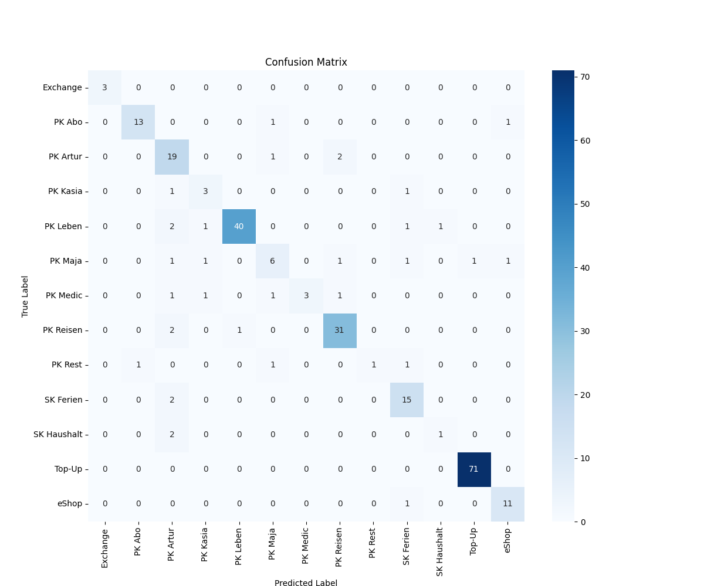

# Projekt Transak - Iteration 1

Artur Fejklowicz


## Automated Revolut transaction classifier with a Wide & Deep Model on Vertex AI Pipelines

This project demonstrates a professional, end-to-end MLOps pipeline for classifying personal Revolut transactions. It uses a custom Two Towers: Wide & Deep model built with TensorFlow/Keras and is orchestrated entirely on Google Cloud using Vertex AI Pipelines with custom container.

## Final Pipeline Architecture

The final pipeline consists of four containerized components that automate the entire process from data ingestion to conditional model registration.


---

## Key Features & Technical Highlights

This project goes beyond a simple training script and implements a full MLOps workflow, showcasing several advanced techniques:

* **Wide & Deep Architecture:** The model combines the "memorization" power of a wide linear model with the "generalization" power of a deep neural network. The wide path uses a `HashedCrossing` of the transaction `type` and `description` to learn specific rules, while the deep path learns complex patterns from a rich set of engineered features.

* **Advanced Feature Engineering:** All preprocessing is handled by custom Keras layers, making the model self-contained and eliminating training-serving skew.
    * **`CyclicalFeature` Layer:** A custom subclassed layer to transform date components (month, day, weekday) into `sin`/`cos` representations, allowing the model to understand cyclical patterns.
    * **`AmountFeatures` Layer:** A custom layer to generate both a `log1p` transformed amount (to handle skewed distributions) and a binary sign feature.
    * **Text & Categorical Embeddings:** Uses `TextVectorization` with n-grams for text descriptions and `StringLookup` for categorical features, both followed by `Embedding` layers to create dense, meaningful representations.

* **Containerized MLOps Pipeline:**
    * The entire workflow is defined as a series of components using the **Kubeflow Pipelines (KFP) SDK**.
    * Each step runs inside a **custom Docker container**, ensuring a reproducible and isolated environment.
    * The pipeline is orchestrated and executed on **Vertex AI Pipelines**, showcasing a modern, serverless approach to MLOps.
    * The pipeline includes **conditional logic** to only register the model if its accuracy on the test set surpasses a predefined threshold.

---

## Results

The final model shows a significant improvement over previous baselines, demonstrating the power of the Wide & Deep architecture and detailed feature engineering.

* **Final Test Accuracy:** 89%
* **Macro Average F1-Score:** 0.76 (a +0.08 improvement, showing much better performance on rare classes)



---

## Project Structure

The project is organized into distinct Python packages to ensure a clean separation of concerns, a best practice for production ML systems.

```
.
├── Dockerfile                  # Defines the Docker image for the Vertex AI custom training and prediction jobs.
├── GEMINI.md                   # Documentation for the Gemini CLI agent and project context.
├── pyproject.toml              # Project dependencies and metadata, including build system configuration.
├── pipelines/                  # Contains Kubeflow Pipelines (KFP) definitions and custom components.
│   ├── components/             # Reusable pipeline components.
│   │   ├── bless_model.py      # Conditional component to bless (promote) a new model.
│   │   ├── bq_config_generator.py # Generates BigQuery configuration for pipeline jobs.
│   │   ├── custom_batch_predict.py # Custom component for batch prediction.
│   │   ├── data_splits.py      # Splits data into training, validation, and test sets.
│   │   ├── evaluation.py       # Evaluates the trained model and generates metrics.
│   │   ├── register.py         # Registers the model in Vertex AI Model Registry.
│   │   ├── trainer.py          # Component for training the machine learning model.
│   │   └── utils.py            # Utility functions for pipeline components.
│   ├── pipeline_predict.py     # Defines the prediction and monitoring pipeline.
│   └── pipeline_train.py       # Defines the training and promotion pipeline.
├── src/                        # Source code for the core application logic and model, served from custom container.
│   ├── common/                 # Shared utility functions and base classes.
│   │   ├── base_sql.py         # Contains base SQL queries for data extraction.
│   │   └── utils.py            # General utility functions.
│   ├── components/             # Modularized components for various ML tasks.
│   │   ├── custom_batch_predict/ # Contains logic for custom batch prediction.
│   │   │   └── task.py         # Entrypoint for the custom batch prediction component.
│   │   ├── data_prep/          # Data preparation and feature engineering.
│   │   │   └── task.py         # Entrypoint for the data preparation component.
│   │   ├── data_splits/        # Data splitting logic (train, validation, test).
│   │   │   └── task.py         # Entrypoint for the data splitting component.
│   │   ├── evaluation/         # Model evaluation logic.
│   │   │   └── task.py         # Entrypoint for the model evaluation component.
│   │   ├── register/           # Model registration logic.
│   │   │   └── task.py         # Entrypoint for the model registration component.
│   │   └── trainer/            # Model training logic.
│   │       ├── model.py        # Defines the Wide & Deep Keras model architecture.
│   │       └── task.py         # Entrypoint for the model training component.
```

---

## How to Run

This project is designed to be run as a Vertex AI Pipeline.

1.  **Set Up Environment:**
    * Ensure the Google Cloud SDK is installed and configured.
    * Create a local Python virtual environment and install dependencies from `pyproject.toml` using `uv pip install .[all]`.

2.  **Build the Container:**
    * From the project root, run the following command to build the custom container and push it to Artifact Registry:
        ```bash
        gcloud builds submit --region="europe-west1" --tag="europe-west6-docker.pkg.dev/af-finanzen/af-finanzen-mlops/transak-i1-train-predict:latest" .
        ```

3.  **Run the Pipeline:**
    * Set the required environment variables in your terminal (`VERTEX_PROJECT_ID`, `VERTEX_REGION`, `VERTEX_BUCKET`, `VERTEX_TENSORBOARD_NAME`).
    * Execute the pipeline script from the project root:
        ```bash
        python -m pipeline.pipeline submit
        ```

